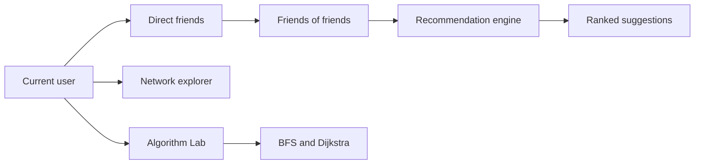

# Graph Social

### A social network you can explore, understand, and grow

Most social platforms show you a list of people.

**Graph Social shows you the relationships between them.**

This project turns a social network into an interactive graph. Every person becomes a node, every friendship becomes an edge, and every recommendation is the result of real graph analysis happening behind the scenes.

Sign in as a demo user, discover people through mutual connections, trace paths across the network, and watch classic algorithms work on live data.

---

## The story behind the project

Imagine a room filled with people.

You know some of them directly. Others are connected through a friend, a classmate, or a colleague. The most interesting connections are often not the obvious ones. They are the people who are only a few steps away.

Graph Social models that room as a graph:

- People are vertices.
- Friendships are edges.
- Mutual friends create stronger recommendations.
- Shortest paths reveal degrees of separation.
- Network statistics show how the whole community is connected.

The result is a learning-focused social network where the interface and the data structures tell the same story.

---

## What you can do

### Explore your dashboard

See your direct friends, network reach, pending requests, and recommended connections at a glance.

### Discover people you may know

Recommendations are ranked using a weighted combination of:

- Adamic-Adar similarity
- Jaccard similarity
- Graph proximity
- Network popularity

The recommendation engine looks beyond direct friends and explains why each person appears.

### Visualize your network

Open the interactive network explorer to:

- Drag nodes around the graph
- Pan across the canvas
- Zoom in and out
- Inspect relationships by hovering
- Open a user's profile by clicking a node

### Learn BFS and Dijkstra

The Algorithm Lab animates two algorithms on the same social graph:

- **BFS** finds the path with the fewest friendship hops.
- **Dijkstra** finds the strongest weighted path, where close mutual connections make an edge cheaper.

You can play, pause, reset, or step through each algorithm one operation at a time.

### Manage connections

Send, accept, decline, and remove friend requests while the graph updates immediately.

### Inspect network analytics

View graph density, average degree, connected components, diameter, clustering, and the most connected people in the network.

---

## Demo access

The app includes ready-to-use demo profiles:

| Username | Password |
| --- | --- |
| `faizan` | `demo123` |
| `ali` | `demo123` |
| `ahmed` | `demo123` |
| `rahul` | `demo123` |

You can also create a new local account from the registration screen.

> This is a frontend demo. Authentication and data are stored locally in the browser and are not suitable for production use.

---

## How the graph works



Friendships are stored as an undirected adjacency list. That means a connection works in both directions while remaining efficient to query and traverse.

The weighted edge cost is:

```text
edge cost = 1 + 2 / (1 + number of mutual friends)
```

A friendship with many mutual connections has a lower cost, allowing Dijkstra to prefer a strong multi-hop route over a weak direct connection.

---

## Project structure

```text
social_network_website/
├── index.html    # HTML shell and app mount point
├── styles.css    # Design tokens, layouts, components, and responsive styles
├── script.js     # Storage, graph logic, recommendations, views, and interactions
└── README.md     # Project documentation
```

### Main JavaScript responsibilities

- `Storage` handles versioned local persistence.
- `SocialGraph` manages users, edges, BFS, Dijkstra, and analytics.
- `MinHeap` powers the Dijkstra priority queue.
- `RecommendationEngine` ranks possible connections.
- `Api` provides an async data-layer boundary for future REST integration.
- `NetworkView` renders the force-directed canvas graph.
- `DsaLab` animates BFS and Dijkstra.

---

## Run it locally

No build tool or package installation is required.

1. Clone the repository:

   ```bash
   git clone https://github.com/MOHAMMED-FAIZAN-KHAN/graph-based-Social-Network-Friend-Suggestion-System.git
   ```

2. Open the project folder.

3. Open `index.html` in a browser.

For the smoothest development experience, serve the folder with any local static server. For example, with Python:

```bash
python -m http.server 8000
```

Then visit:

```text
http://localhost:8000
```

---

## Design principles

Graph Social is designed around a few simple ideas:

- Make complex algorithms visible.
- Explain recommendations instead of hiding them.
- Keep common actions quick and clear.
- Make the graph feel like a living map.
- Preserve a useful experience on small screens.
- Keep the frontend dependency-free and easy to inspect.

The visual system includes light and dark themes, responsive navigation, animated cards, accessible focus states, loading skeletons, feedback toasts, and an interactive canvas experience.

---

## Future direction

The current app uses local browser storage, but its data layer is intentionally separated from the interface. That makes it possible to replace the demo persistence layer with a real backend later.

Possible next steps include:

- REST API integration
- Secure server-side authentication
- MySQL or PostgreSQL persistence
- Real-time notifications
- Larger graph datasets
- Community detection and graph clustering
- Friend recommendation evaluation metrics

The interface is already prepared for that journey: the graph is the foundation, and the backend can grow around it.

---

## Why this project matters

A recommendation is more useful when you can understand it.

Graph Social is not just a social network mockup. It is a visual explanation of how relationships, algorithms, and communities fit together. It turns abstract data structures into something you can explore with your own hands.

**Do not just connect. Understand the network.**

---

## License

This project is intended for learning, demonstration, and portfolio use.
