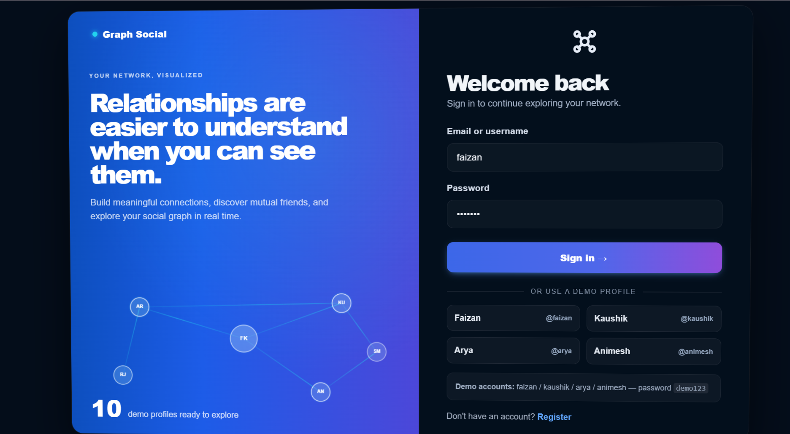
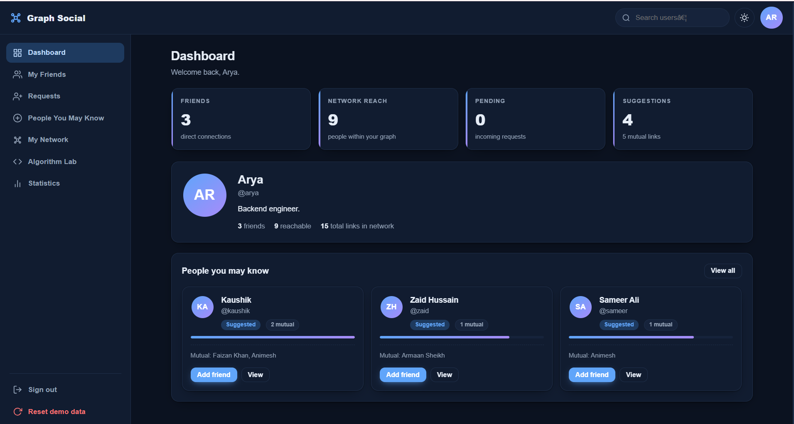
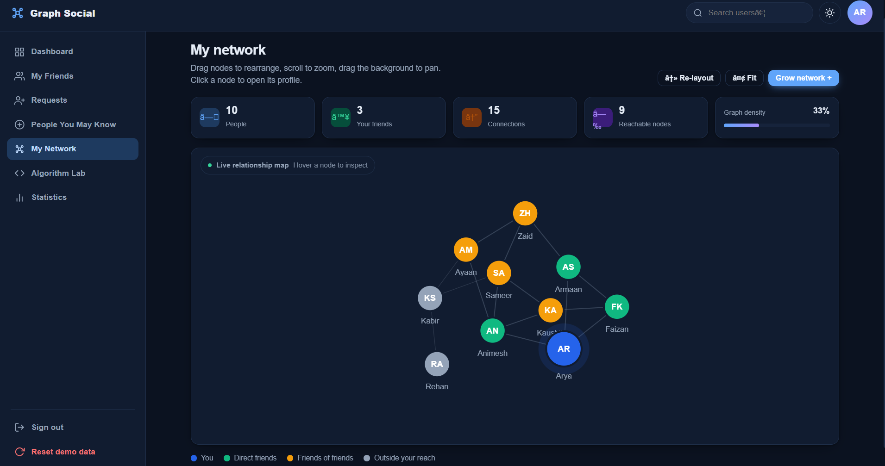
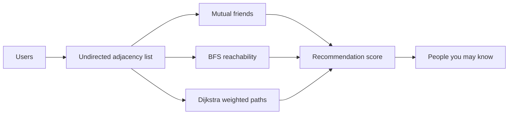

# Graph Social

### See the connections. Understand the network.

Graph Social is a frontend-only social-network playground where friendships become an interactive graph. Sign in with a demo profile, discover recommendations, inspect relationships, and watch BFS or Dijkstra explore the network step by step.

<p align="center">
  <a href="#-try-the-demo"><strong>Try the demo</strong></a> ·
  <a href="#-visual-tour">Visual tour</a> ·
  <a href="#-how-the-graph-thinks">How it works</a> ·
  <a href="#-run-locally">Run locally</a>
</p>

<p align="center">
  
  
  
  
</p>

> **The idea:** a friendship is an edge, a person is a node, and every recommendation has a reason.

## ✨ What makes it interesting?

| Experience | What you can do |
| --- | --- |
| **Animated auth** | Enter through a canvas particle scene with a live mini-network and parallax login card. |
| **Recommendation engine** | Find people using mutual friends, Jaccard similarity, graph proximity, and popularity. |
| **Interactive network** | Drag nodes, pan, zoom, hover for context, and open profiles directly from the graph. |
| **Algorithm Lab** | Play, pause, reset, or step through BFS and Dijkstra traversals. |
| **Persistent demo** | Accounts, friendships, requests, theme preference, and session state survive refreshes. |
| **Responsive themes** | Use the desktop shell or a smaller screen, with working light and dark modes. |

## 🎬 Visual tour

### 1. Enter the network

The login screen makes the concept visible immediately: the animated network is not decoration, it is the product.

<p align="center">
  
</p>

### 2. Read the shape of your world

The dashboard turns graph data into a quick overview: direct friends, reachable people, pending requests, and useful suggestions.

<p align="center">
  
</p>

### 3. Explore the graph itself

Switch to **My Network** to manipulate the relationship map. The graph responds to dragging, zooming, panning, and node selection.

<p align="center">
  
</p>

## 🚀 Try the demo

1. Start the app locally.
2. Sign in with `faizan` and `demo123`.
3. Open **People You May Know** and inspect why each person was suggested.
4. Open **My Network** and drag a node around the canvas.
5. Visit **Algorithm Lab** and step through BFS or Dijkstra.
6. Toggle light/dark mode from the top bar, then refresh to see the preference persist.

### Demo accounts

| Username | Email | Password |
| --- | --- | --- |
| `faizan` | `faizan@demo.com` | `demo123` |
| `kaushik` | `kaushik@demo.com` | `demo123` |
| `arya` | `arya@demo.com` | `demo123` |
| `animesh` | `animesh@demo.com` | `demo123` |

You can sign in with either the username or the email address.

## 🧠 How the graph thinks



Friendships are stored as an undirected adjacency list. Recommendations combine:

- **Adamic-Adar** for meaningful shared connections
- **Jaccard similarity** for neighborhood overlap
- **Graph proximity** for distance through the network
- **Popularity** for useful network context

The weighted edge cost is:

```text
edge cost = 1 + 2 / (1 + number of mutual friends)
```

More mutual friends make a connection cheaper, allowing Dijkstra to prefer stronger routes through the graph.

<details>
<summary><strong>What happens when you click a recommendation?</strong></summary>

Graph Social checks the current relationship, prevents duplicate or invalid requests, stores the request locally, refreshes recommendations, and rerenders the relevant view. The interface is backed by real graph state rather than static cards.

</details>

## 🧩 Main modules

| Module | Responsibility |
| --- | --- |
| `Storage` | Versioned local persistence with an in-memory fallback. |
| `SocialGraph` | Users, edges, BFS, Dijkstra, reachability, and graph analytics. |
| `MinHeap` | Priority queue used by Dijkstra. |
| `RecommendationEngine` | Scores and explains people-you-may-know results. |
| `Api` | Async data boundary that can later point to a real backend. |
| `AuthEffects` | Login particles, mini-network canvas, and card tilt. |
| `NetworkView` | Interactive force-directed network canvas. |
| `DsaLab` | BFS and Dijkstra visualization controls and animation. |

## 🛠️ Run locally

No build tool or dependency installation is required.

```bash
python -m http.server 8000
```

Open [http://localhost:8000](http://localhost:8000) in your browser. You can also open `index.html` directly, although a local server gives the most reliable canvas behavior.

## 📁 Project structure

```text
social_network_website/
|-- index.html    # HTML shell, app mount point, and background canvas
|-- styles.css    # Theme tokens, auth UI, app shell, graph, and responsive styles
|-- script.js     # Data, algorithms, rendering, auth, canvases, and app events
|-- login_page.png
|-- dashboard_img.png
|-- network_img.png
|-- README.md     # Visual project documentation
```

## 🔌 Backend path

The frontend already has an `Api` layer, so local persistence can later be replaced with REST endpoints without rewriting the UI.

Possible next steps include secure authentication, MySQL or PostgreSQL persistence, real-time notifications, larger datasets, community detection, and recommendation evaluation metrics.

## ⚠️ Note

This is a portfolio/demo frontend. Authentication is local to the browser and is not production security.

## ✅ Validation

```bash
node --check script.js
```
